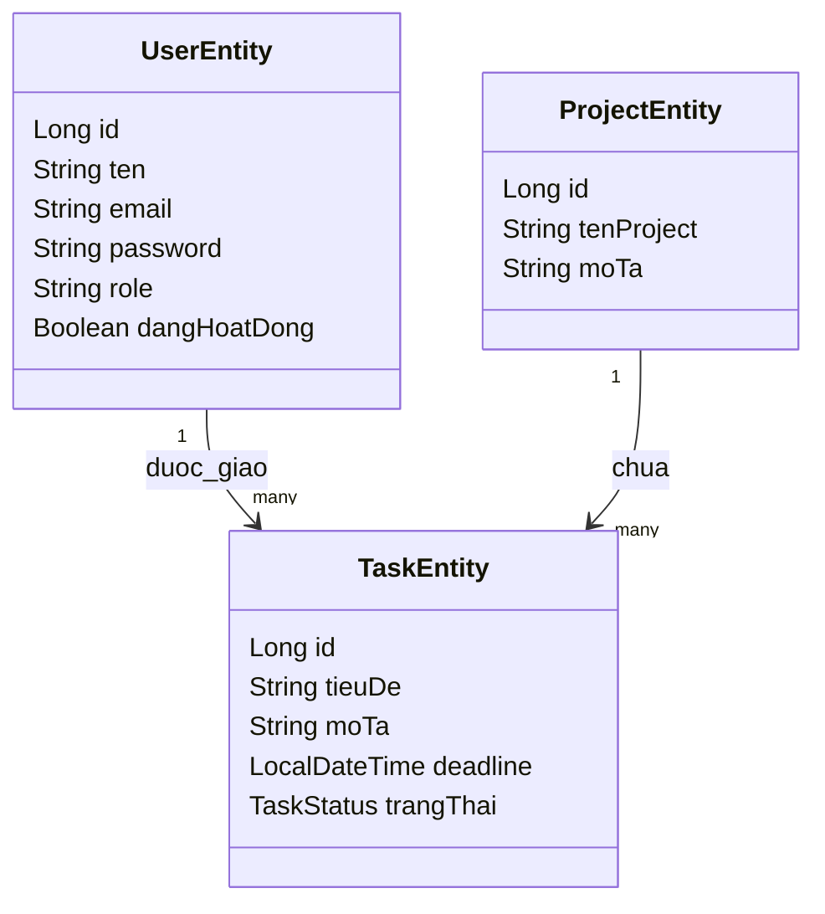

# Kiến trúc hệ thống - Task Management API

## 1. Công nghệ sử dụng
- Java 17
- Spring Boot 3
- Spring Web
- Spring Data JPA
- Spring Security
- JWT (jjwt)
- SQL Server
- Swagger / OpenAPI
- JUnit 5 + Mockito

---

## 2. Kiến trúc nhiều tầng

```text
Client / Postman / Swagger
          |
          v
      Controller
          |
          v
       Service
          |
          v
     Repository
          |
          v
       SQL Server
```

---

## 3. Chức năng của từng tầng

### Controller
- Nhận HTTP request
- Validate đầu vào cơ bản với `@Valid`
- Gọi service xử lý
- Trả về `ApiResponse`

### Service
- Chứa logic nghiệp vụ chính
- Kiểm tra rule:
  - deadline phải ở tương lai
  - task đã hoàn thành thì không assign/update
  - không cho chuyển trực tiếp từ `CHUA_LAM` sang `HOAN_THANH`
- Xử lý login/register và tạo JWT

### Repository
- Dùng Spring Data JPA
- Tự động truy vấn theo method name
- Ví dụ:
  - `findByUser_Id(...)`
  - `findByProject_Id(...)`
  - `findByEmail(...)`

### Security
- `JwtService`: tạo token, đọc claims, validate token
- `JwtAuthFilter`: lấy Bearer token từ header rồi đưa vào SecurityContext
- `SecurityConfig`: khai báo endpoint nào public, endpoint nào theo role

### Exception Handler
- Gom lỗi về một nơi
- Trả lỗi chuẩn theo HTTP code: 400, 404, 500

---

## 4. Các module chính

### Auth module
- `/api/auth/register`
- `/api/auth/login`
- Trả token JWT sau khi đăng nhập thành công

### User module
- CRUD user
- Hiện đang giới hạn quyền truy cập cho MANAGER

### Project module
- Lấy danh sách project
- Tạo project mới
- Chỉ MANAGER được tạo/sửa/xóa

### Task module
- Tạo task
- Assign task cho user
- Update status
- Xem task theo user
- Xem task theo project
- User xem task của chính mình qua `/api/tasks/my`

---

## 5. Quan hệ dữ liệu chính



---

## 6. Luồng request điển hình
1. Client gửi request tới API
2. Security filter kiểm tra JWT nếu endpoint cần auth
3. Controller nhận request
4. Service kiểm tra nghiệp vụ
5. Repository thao tác DB
6. Trả dữ liệu về theo chuẩn `ApiResponse`
7. Nếu có lỗi → `GlobalExceptionHandler` xử lý
